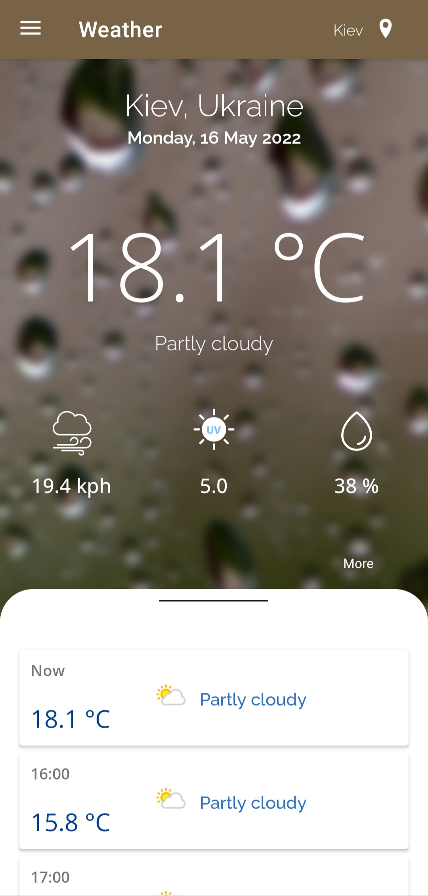
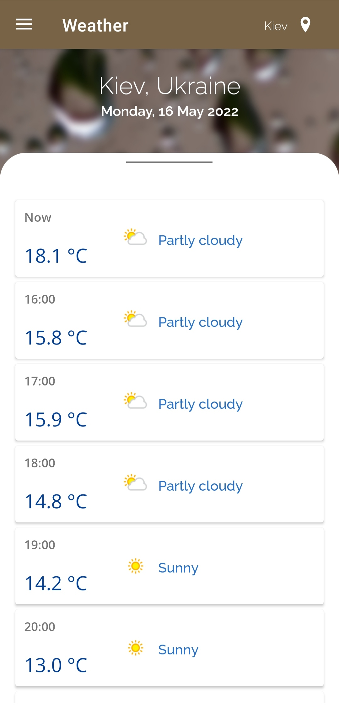
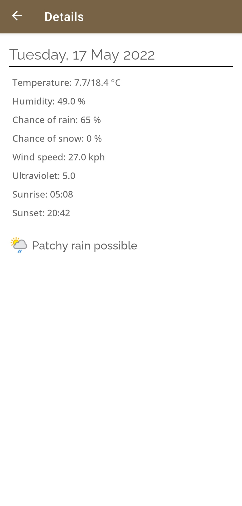

# LBWeather

Weather app to show weather data at your location.

I used retrofit and moshi to get and parse the date from the weather API. I received a request in the coroutines and updated the viewmodel livedata to show the data to the user.
Navigating to switch between fragments also I use single activity to show my fragments.

I also used Shared Preference and Glide

to show a list of weather data, I used the bottom sheet and attached it to the final text element to improve the display. 

I tried to follow the principles SOLID and I used pattern MVVM

  
